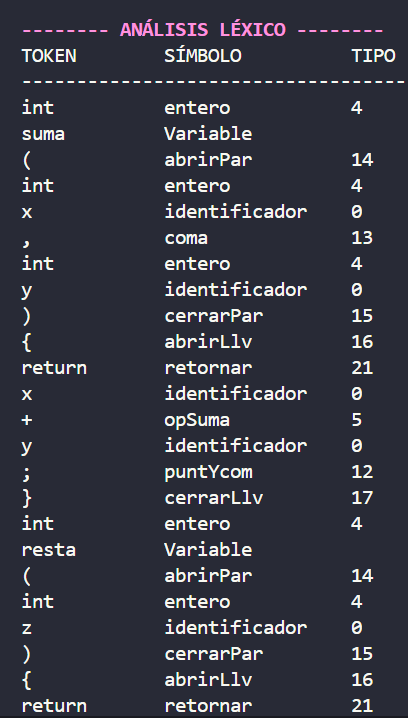
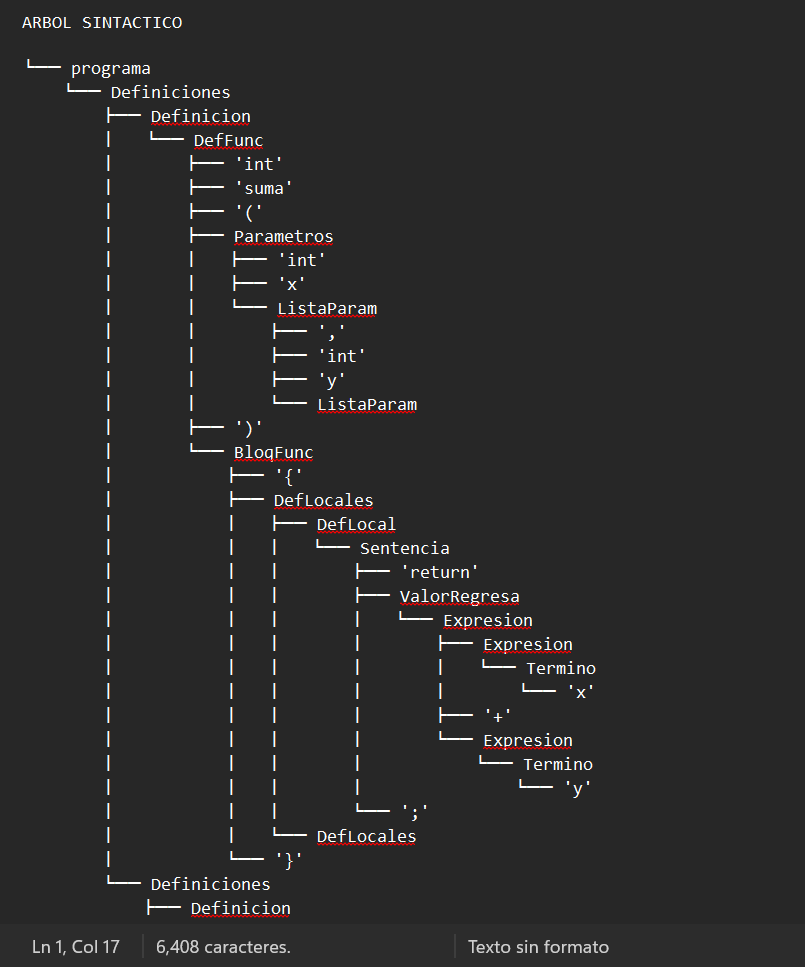
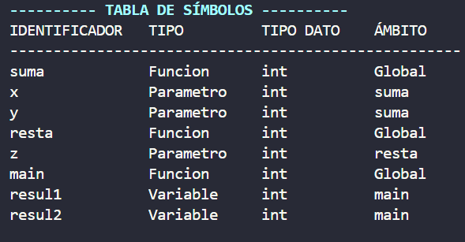
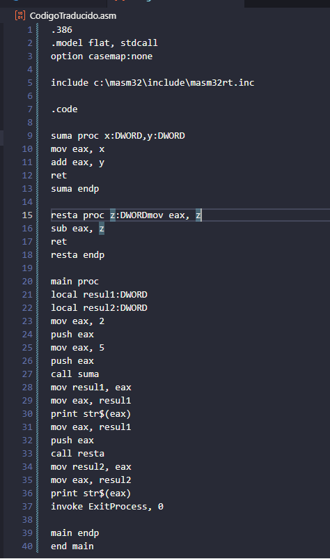

# Compilador 

Proyecto de **Seminario de Traductores** que implementa un mini compilador para un lenguaje tipo C. El compilador realiza:

- Análisis léxico
- Análisis sintáctico (LR)
- Construcción de árbol sintáctico
- Análisis semántico y tabla de símbolos
- Generación de código en ensamblador MASM ([CodigoTraducido.asm](CodigoTraducido.asm))

Todo el flujo se orquesta desde [main.py](main.py), tomando como entrada un archivo de código fuente (`test.txt` por defecto).

---

## Requisitos

- Python 3.x
- Windows (se usan rutas y `os.startfile` específicas de Windows)
- Para ensamblar/ejecutar el código generado: **MASM32** instalado en `C:\masm32` (ruta usada en [analisisSemantico.py](analisisSemantico.py)).

---

## Cómo ejecutar

1. Coloca el programa de prueba en alguno de estos archivos:
	 - [test.txt](test.txt)
	 - [test2.txt](test2.txt)
	 - [test3.txt](test3.txt)
2. Asegúrate de que [main.py](main.py) apunte al archivo que quieres probar (por defecto usa `test.txt`).
3. Desde la carpeta del proyecto ejecuta:

	 ```bash
	 python main.py
	 ```

Durante la ejecución verás en la terminal:

- Encabezado con el **código de entrada**.
- **Análisis léxico** en formato de tabla (TOKEN / SÍMBOLO / TIPO).
- Mensajes del **análisis sintáctico LR** (para ejercicios y para el compilador completo).
- Un **árbol sintáctico gráfico** con ramas (`├──`, `└──`).
- Salida del **análisis semántico** y la **tabla de símbolos** en tabla.

Además se generan/actualizan los archivos:

- [CodigoTraducido.asm](CodigoTraducido.asm): código ensamblador MASM.
- `arbol_sintactico.txt`: versión del árbol sintáctico en texto, que se abre automáticamente en una ventana aparte.

---

## Estructura del proyecto

- [main.py](main.py)
	- Punto de entrada del compilador.
	- Lee el archivo de prueba (`test.txt`).
	- Muestra el código fuente con encabezado en color.
	- Llama a `AnalisisLexico` y luego al análisis sintáctico completo (`sintactico.compilador`).

- [analisisLexico.py](analisisLexico.py)
	- Función `AnalisisLexico(test)`.
	- Recorre el texto de entrada, separa en tokens y los clasifica en:
		- Identificadores
		- Operadores (`+`, `-`, `*`, `/`, relacionales, lógicos, etc.)
		- Signos de puntuación (`;`, `,`, `(`, `)`, `{`, `}`)
		- Palabras reservadas (`if`, `while`, `return`, `int`, `float`, `main`, ...)
		- Números enteros y reales
	- Imprime una **tabla** alineada con columnas `TOKEN`, `SÍMBOLO`, `TIPO`.
	- Devuelve una cadena de tokens separada por espacios que se usa como entrada del parser.
	
	**Ejemplo de salida del análisis léxico**

	

- [analisisLexico2.py](analisisLexico2.py)
	- Clase `analizador`.
	- Implementa un **autómata finito** para clasificar cada lexema individual.
	- `evaluaElemento(cadena)` devuelve un estado final.
	- `returnTipo(estado)` mapea ese estado a:
		- Nombre lógico (por ejemplo, `Entero`, `Identificador`, `if`, `+`, etc.).
		- Índice de columna usado por la tabla LR de [compilador.lr](compilador.lr).
	- Es el léxico formal que usa el analizador sintáctico LR.

- [analisisSintactico.py](analisisSintactico.py)
	- Clase `sintactico`.
	- Implementa 3 cosas principales:
		- `ejercicio_1` y `ejercicio_2`: ejemplos de analizadores LR sencillos (expresiones con identificadores y `+`).
		- `readFile()`: lee [compilador.lr](compilador.lr) y carga:
			- Reglas de la gramática (no terminal, número de elementos a hacer `pop`, nombre de regla).
			- Matriz de la tabla LR (acciones `shift`, `reduce`, `accept`).
		- `compilador(e)`: parser LR completo para el lenguaje tipo C definido en `compilador.lr`.
	- Usa una pila propia definida en [pila.py](pila.py) y elementos de [elementoPila.py](elementoPila.py).
	- En cada **reduce** crea nodos del árbol sintáctico (`Nodo` de [arbolSintactico.py](arbolSintactico.py)).
	- Cuando se acepta la entrada:
		- Imprime un encabezado de **ÁRBOL SINTÁCTICO** en color.
		- Construye el árbol completo y lo muestra gráficamente.
		- Lo vuelca también en `arbol_sintactico.txt` y lo abre con `os.startfile`.
		- Invoca al analizador semántico (`Semantico`) para validar y generar código ensamblador.

- [arbolSintactico.py](arbolSintactico.py)
	- Clase `Nodo`: representa un nodo de la gramática (regla) con una lista de elementos hijos.
	- Clase `arbolSintactico`:
		- `imprimirArbol`: recorrido original (ya no se usa directamente en la salida principal).
		- `imprimirArbolGrafico(nodo, prefijo, esUltimo)`: imprime el árbol con ramas ASCII (`├──`, `└──`, `│`).
		- `escribirArbolGrafico(nodo, archivo, ...)`: misma idea pero escribiendo en un archivo de texto.
	
	**Ejemplo de árbol sintáctico en archivo de texto**

	

- [elementoPila.py](elementoPila.py)
	- Clase base `elementoPila` y derivadas `terminal`, `noTerminal`, `estado`.
	- Cada elemento de la pila lleva:
		- `valor` (símbolo/estado).
		- `id` (tipo de elemento en la pila).
		- Un `Nodo` asociado para enlazar con el árbol sintáctico.

- [pila.py](pila.py)
	- Implementación simple de una **pila** (stack) con `push`, `pop`, `top`, etc.
	- Es la estructura base usada por el parser LR.

- [analisisSemantico.py](analisisSemantico.py)
	- Clases:
		- `Simbolo`: entrada genérica de la **tabla de símbolos** (identificador, tipo, tipo de dato, ámbito).
		- `Funcion(Simbolo)`: extiende símbolo con número de parámetros.
		- `Semantico`: realiza el análisis semántico y la generación de código.
	- Funciones principales:
		- `crearArchivo()`: inicializa [CodigoTraducido.asm](CodigoTraducido.asm) con encabezado MASM.
		- `analiza(n, archivo)`: recorre recursivamente el árbol sintáctico para:
			- Poblar la tabla de símbolos (funciones, parámetros, variables locales).
			- Verificar errores semánticos:
				- Variables/funciones no declaradas.
				- Variables/funciones/parámetros redefinidos.
				- Número incorrecto de argumentos en llamadas a funciones.
			- Generar código ensamblador para:
				- Declaraciones de funciones (`proc` / `endp`).
				- Variables locales (`local x:DWORD`).
				- Asignaciones y expresiones aritméticas (`mov`, `add`, `sub`).
				- Llamadas a funciones (`push` de argumentos, `call`).
				- Impresiones simples con `print str$(eax)`.
		- `muestraSimbolos()`: imprime la **tabla de símbolos** como una tabla alineada:
			- Columnas: `IDENTIFICADOR`, `TIPO`, `TIPO DATO`, `ÁMBITO`.
		- `muestraErrores()`: lista de errores semánticos encontrados (o mensaje de que no hubo errores).
	
	**Ejemplo de tabla de símbolos**

	

- [colores.py](colores.py)
	- Constantes ANSI para colores en consola:
		- `HEADER`, `SUBHEADER`, `OK`, `WARNING`, `ERROR`, `RESET`, etc.
	- Usado para resaltar encabezados y mensajes importantes.

- [compilador.lr](compilador.lr)
	- Archivo de configuración del **parser LR**.
	- Contiene:
		- Definición compacta de las reglas de gramática (no terminal, longitud de producción, nombre de regla).
		- La matriz de la tabla LR (acciones para cada estado y tipo de token).

---

## Archivo .asm

El archivo [CodigoTraducido.asm](CodigoTraducido.asm) contiene el código ensamblador generado por el compilador. Este archivo es el resultado final del proceso de compilación y está diseñado para ser ensamblado y ejecutado utilizando MASM32. Representa la traducción del código fuente de entrada al lenguaje ensamblador, siguiendo las reglas y estructuras definidas por el compilador.



---

## Archivos de prueba

- [test.txt](test.txt)
	- Ejemplo base con funciones `suma`, `resta` y `main`.
	- Llama a `suma(8, 9)` y luego a `resta(resul1)`.

- [test2.txt](test2.txt)
	- Funciones `cuadrado` y `sumaTres` con varios parámetros y variables temporales.
	- `main` realiza llamadas anidadas para probar parámetros y retornos.

- [test3.txt](test3.txt)
	- Función `identidad` y un `main` con asignaciones simples.
	- Útil para probar la tabla de símbolos y la detección de identificadores.

Puedes modificar cualquiera de estos archivos o crear nuevos, mientras respetes la sintaxis del lenguaje (tokens separados por espacios y construcciones soportadas por `compilador.lr`).

---
<div align="center">
	<b>✨ OCHOA ORTEGA ANDREA J.</b><br>
	<br>
	<sub>Seminario de solución de problemas de traductores de lenguaje.</sub><br>
	<br>
	
	<br>
</div>
